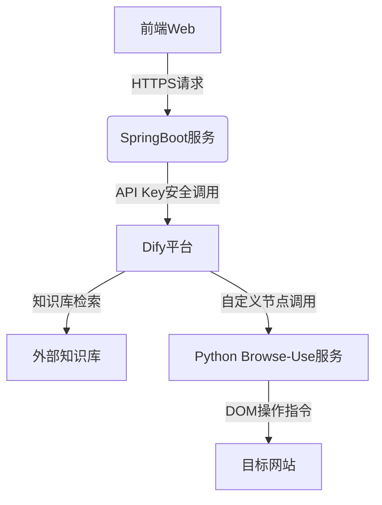
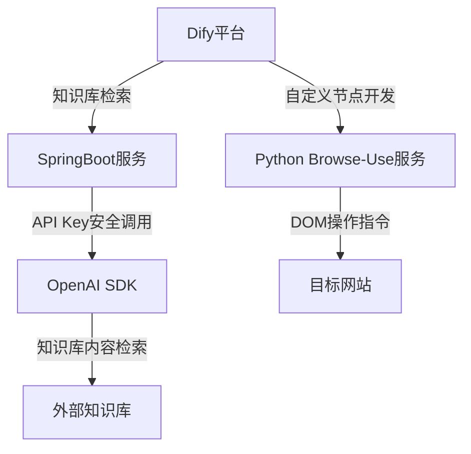

# 智能3D模型交互系统技术方案

## 一、系统架构

## 二、核心组件说明
1. 前端Web
   - 技术栈: Vite + Vue3 + ThreeJS构建
   - 通信机制: 仅与SpringBoot服务通过HTTPS通信
   - 核心功能:
   - ThreeJS模型渲染（支持GLB/GLTF格式）
   - 交互锚点自动识别（anchor_前缀命名规范）
   - 操作指令双向校验机制

2. SpringBoot服务
   - 技术栈: SpringBoot + OpenAI SDK
   - 通信机制: HTTPS请求
   - 核心功能: 
   - 安全API Key管理
   - 代理请求Dify平台
   - 知识库检索服务
   - 自定义节点调用服务
3. Dify平台
   - 技术栈: Dify平台
   - 通信机制: 内部调用
   - 核心功能:
   - 知识库管理
   - 自定义节点开发
   - 流程编排
   - 模型调用
   - 交互指令生成
4. Python Browse-Use服务
   - 技术栈: Python + Selenium + ChromeDriver  
   - 通信机制: 内部调用
   - 核心功能:
   - 网页DOM操作指令解析
   - 执行DOM操作指令
   - 生成操作结果
5. 外部知识库
   - 技术栈: 自定义知识库格式
   - 核心功能:
   - 知识库内容存储
   - 知识库内容检索
   - 知识库内容更新
6. 目标网站
   - 技术栈: 自定义网站格式
   - 核心功能:
   - 网站DOM操作指令解析
   - 执行DOM操作指令
   - 生成操作结果
   - 支持自定义节点开发

## 三、Dify与AI指令集成模块

1. **知识库检索**
   - 功能: 从外部知识库中检索相关内容
   - 输入: 自然语言指令
   - 输出: 相关内容
2. **自定义节点开发**
   - 功能: 支持自定义节点开发，支持复杂的操作
   - 输入: 自然语言指令
   - 输出: 执行结果
3. **交互指令生成**
   - 功能: 生成交互指令
   - 输入: 自然语言指令
   - 输出: 交互指令
4. **知识库构建**
   - 上传`operation_manual.md`，包含指令语法：
   ```markdown  
     ## 指令规范  
     - 旋转：[方向] [角度]度 (例：向左旋转30度)  
     - 缩放：[比例]倍 (例：放大1.5倍)  
     - 定位：聚焦[部件名] (例：聚焦anchor_pump)  
     ```  
   - 启用RAG增强，设置相似度阈值0.7  
5. **API调用逻辑**：
    - 通过SpringBoot服务调用Dify `/v1/chat-messages`接口，传递用户自然语言指令
    - 响应解析：提取JSON中的`action`字段（如`{"type":"rotate", "params":{"direction":"left", "angle":30}}`）

6. **安全方案**：
    - 在SpringBoot中通过`@ConfigurationProperties`注入Dify API Key
    - 启用HMAC签名验证请求来源

## 四、Browse-Use服务桥接模块
用Python编写Browser-Use服务桥接层，要求：
1. **指令转换**：
    - 接收SpringBoot传来的`action` JSON，转换为Playwright操作：
      ```python  
      if action["type"] == "rotate":
          await page.evaluate(f"""
              model.children.find(c => c.userData.operation === 'rotate').rotation.y += {action["params"]["angle"]}  
          """)  
      ```  
2. **DOM操作规范**：
    - 对ThreeJS画布元素（`<canvas id="modelViewer">`）启用强制等待机制
    - 通过`page.expose_function`向浏览器上下文注入`threejsControl`方法

3. **异常处理**：
    - 当操作超时（>5秒）时，截图保存至`/errors/[timestamp].png`
    - 通过WebSocket实时推送操作日志到SpringBoot

## 五、全链路测试方案
提问模板：
设计端到端测试用例便于记录每一次的测试结果和优化方向，覆盖：
1. **正向流程**：
    - 用户输入“放大会议室区域” → Dify返回`{"type":"zoom", "target":"Meeting_Room"}` → 前端模型对应部件放大1.2倍
    - 用户输入“放大区域A”  → Dify返回`{"type":"zoom", "target":"region_A"}` → 前端模型对应部件放大1.2倍

2. **边界条件**：
    - 缩放倍数超过2倍时，触发`OverScaleException`并回滚至上限
    - 无效部件名时，通过ThreeJS的`scene.getObjectByName`返回404错误

3. **性能指标**：
    - 模型加载时间 <3s（启用IndexedDB缓存）
    - AI指令响应延迟 <1.5s（需启用Dify的`response_mode: "streaming"`）

## 六、技术难点及解决方案
1. 模型加载与渲染
   - 难点: ThreeJS模型加载速度慢，渲染效果不佳
   - 解决方案: 使用GLB/GLTF格式模型，优化模型加载与渲染
2. 交互指令解析与执行
   - 难点: 指令解析与执行逻辑复杂，容易出错
   - 解决方案: 采用自然语言指令，通过自然语言处理技术解析指令，生成执行逻辑
3. 安全API Key管理
   - 难点: 如何安全管理API Key，避免泄露
   - 解决方案: 使用HTTPS通信，采用API Key安全调用机制
4. 自定义节点开发
   - 难点: 如何开发自定义节点，支持复杂的操作
   - 解决方案: 采用Python语言开发自定义节点，支持复杂的操作，通过Dify平台进行调用
   
## 七、现有问题及解决思路
1. **Playwright 本身无法直接操作** Three.js 渲染的 3D 模型（如缩放、旋转等几何变换），因为 Three.js 模型是基于 WebGL/Canvas 渲染的，没有传统 DOM 元素的可访问性。但通过间接方式可以实现部分控制，具体方法如下：
   - a. 确保 Three.js 模型对象（如 mesh 或 model）已暴露在全局作用域，可通过 page.evaluate() 直接修改其属性：
   - b. 如果页面提供了可视化控件（如按钮、滑块）用于操作模型，Playwright 可模拟用户交互：
   - c. 最终考虑：对于需要复杂交互的场景，可通过加载浏览器扩展增强控制能力（如自定义 Three.js 调试工具）
2. **具体实现思路**
   - a. 先在前端埋点，预留几个按钮，对应模型文件的区域，点击这些区域按钮可以切换到模型对应的区域位置上，也就是放大这个区域的信息，并旋转定位到该区域的位置。
   - b. 确保这些区域的按钮在页面点击交互时可用，然后修改完善知识库的操作MarkDown  xxxx.md文档，重新上传到知识库中，然后利用AI Agent进行交互，使其直接操作Playwright用于实现，AI Agent只能操作模型的效果。

    

